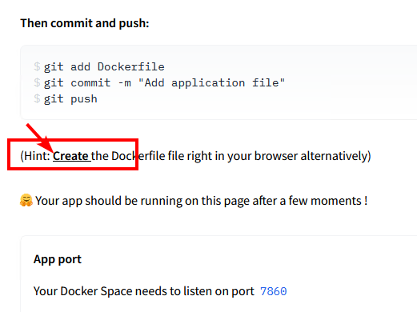

# Deploy to Huggingface Space

This repository can be deployed to a [Huggingface Space](https://huggingface.co/spaces).  This is a free service that allows you to run a simple server in the cloud.  You can use it to safely share your OpenAI API key with a friend.

### 1. Get an API key
- Go to [OpenAI](https://openai.com/) and sign up for an account. You can use a free trial key for this as long as you provide SMS verification.
    - Claude is not publicly available yet, but if you have access to it via the [Anthropic](https://www.anthropic.com/) closed beta, you can also use that key with the proxy.

### 2. Create an empty Huggingface Space
- Go to [Huggingface](https://huggingface.co/) and sign up for an account.
- Once logged in, [create a new Space](https://huggingface.co/new-space).
- Provide a name for your Space and select "Docker" as the SDK.  Select "Blank" for the template.
- Click "Create Space" and wait for the Space to be created.


### 3. Create an empty Dockerfile
- Once your Space is created, you'll see an option to "Create the Dockerfile in your browser".  Click that link.


- Paste the following into the text editor and click "Save".
```dockerfile
FROM node:18-bullseye-slim
RUN apt-get update && \
    apt-get install -y git
RUN git clone https://gitgud.io/khanon/oai-reverse-proxy.git /app
WORKDIR /app
RUN npm install
COPY Dockerfile greeting.md* .env* ./
RUN npm run build
EXPOSE 7860
ENV NODE_ENV=production
CMD [ "npm", "start" ]
```
- Click "Commit new file to `main`" to save the Dockerfile.


### 4. Set your API key as a secret
- Click the Settings button in the top right corner of your repository.
- Scroll down to the `Repository Secrets` section and click `New Secret`.


- Enter `OPENAI_KEY` as the name and your OpenAI API key as the value.
    - For Claude, set `ANTHROPIC_KEY` instead.
    - You can use both types of keys at the same time if you want.


### 5. Deploy the server
- Your server should automatically deploy when you add the secret, but if not you can select `Factory Reboot` from that same Settings menu.

### 6. Share the link
- The Service Info section below should show the URL for your server. You can share this with anyone to safely give them access to your API key.
- Your friend doesn't need any API key of their own, they just need your link.

# Optional

## Updating the server

To update your server, go to the Settings menu and select `Factory Reboot`.  This will pull the latest version of the code from GitHub and restart the server.

Note that if you just perform a regular Restart, the server will be restarted with the same code that was running before.

## Adding a greeting message

You can create a Markdown file called `greeting.md` to display a message on the Server Info page.  This is a good place to put instructions for how to use the server.

## Customizing the server

The server will be started with some default configuration, but you can override it by adding a `.env` file to your Space.  You can use Huggingface's web editor to create a new `.env` file alongside your Dockerfile. Huggingface will restart your server automatically when you save the file.

Here are some example settings:
```shell
# Requests per minute per IP address
MODEL_RATE_LIMIT=4
# Max tokens to request from OpenAI
MAX_OUTPUT_TOKENS_OPENAI=256
# Max tokens to request from Anthropic (Claude)
MAX_OUTPUT_TOKENS_ANTHROPIC=512
# Block prompts containing disallowed characters
REJECT_DISALLOWED=false
REJECT_MESSAGE="This content violates /aicg/'s acceptable use policy."
```

See `.env.example` for a full list of available settings, or check `config.ts` for details on what each setting does.

## Restricting access to the server

If you want to restrict access to the server, you can set a `PROXY_KEY` secret.  This key will need to be passed in the Authentication header of every request to the server, just like an OpenAI API key.

Add this using the same method as the OPENAI_KEY secret above. Don't add this to your `.env` file because that file is public and anyone can see it.
